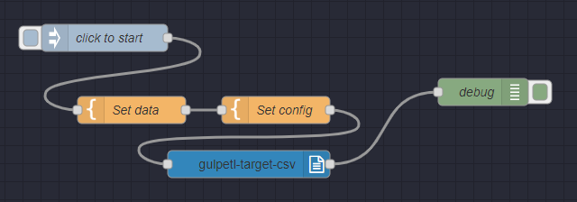
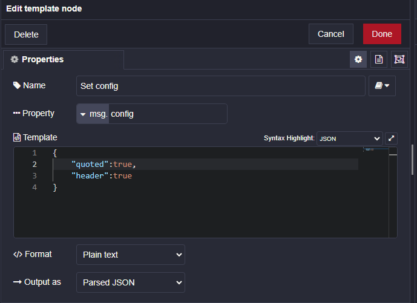

# gulp-etl-target-csv #

This plugin creates CSV files from **gulp-etl** **Message Stream** files; originally adapted from the [gulp-etl-handlelines](https://github.com/gulpetl/gulp-etl-handlelines) model plugin. It is a **gulp-etl** wrapper for [csv-stringify](https://csv.js.org/stringify/).

This is a **[gulp-etl](https://gulpetl.com/)** plugin, and as such it is a [gulp](https://gulpjs.com/) plugin. **gulp-etl** plugins work with [ndjson](http://ndjson.org/) data streams/files which we call **Message Streams** and which are compliant with the [Singer specification](https://github.com/singer-io/getting-started/blob/master/docs/SPEC.md#output). Message Streams look like this:

``` ndjson
{"type": "SCHEMA", "stream": "users", "key_properties": ["id"], "schema": {"required": ["id"], "type": "object", "properties": {"id": {"type": "integer"}}}}
{"type": "RECORD", "stream": "users", "record": {"id": 1, "name": "Chris"}}
{"type": "RECORD", "stream": "users", "record": {"id": 2, "name": "Mike"}}
{"type": "SCHEMA", "stream": "locations", "key_properties": ["id"], "schema": {"required": ["id"], "type": "object", "properties": {"id": {"type": "integer"}}}}
{"type": "RECORD", "stream": "locations", "record": {"id": 1, "name": "Philadelphia"}}
{"type": "STATE", "value": {"users": 2, "locations": 1}}
```

## Usage ##

**gulp-etl** plugins accept a configObj as the first parameter; the configObj
will contain any info the plugin needs. For this plugin the configObj is the "Options" object for [csv-stringify](https://csv.js.org/stringify/), described [here](https://csv.js.org/stringify/options/). *Note: `header` property is defaulted to true by this plugin.*

### Sample gulpfile.js ###

``` javascript
var gulp = require('gulp')
var targetCsv = require('gulp-etl-target-csv').targetCsv

exports.default = function() {
    return gulp.src('data/*.ndjson')
    .on('data', function (file) {
        console.log('Starting processing on ' + file.basename)
    })  
    .pipe(targetCsv({header:true}))
    .on('end', function (file) {
        console.log('Done processing on ' + file.basename)
    })  
    .pipe(gulp.dest('data/'));
}
```

### gulp-data ###
This plugin supports the use of the [gulp-data](https://github.com/colynb/gulp-data#readme) api for passing in its configObj parameter. This
allows data/options from the pipeline to be used to create options passed to this plugin when it runs. 

See the demonstration in `debug/gulpfile.ts` for usage examples.

### Node-RED ###
[Node-RED](https://nodered.org/) is a low-code, visual programming environment for event-driven applications. We're experimenting with it, and this plugin is now available as a Node-RED node. Since we're still in test mode, we aren't yet available in Node-RED's Palette; add to Node-RED by going to your user folder and typing:
```
npm install gulp-etl-target-csv
```

#### Demo flow ####



#### Set data ####

For our demo, we set the data in a "Set data" Template node. The data should be valid NDJSON records, output as plain text:

``` ndjson
{"type":"RECORD","stream":"cars","record":{"carModel":"Audi","price":"10000","color":"blue"}}
{"type":"RECORD","stream":"cars","record":{"carModel":"BMW","price":"15000","color":"red"}}
```

#### Set config ####

The config is also set in a Template node. Identical to the `configObj` above, it is the "Options" object for [csv-stringify](https://csv.js.org/stringify/), described [here](https://csv.js.org/stringify/options/), and you can set any of the properties described.




Copy this flow here for import in Node-RED under `Import`

``` json
[{"id":"8b709063b40e4118","type":"template","z":"cd67672e19ab739a","name":"Set data","field":"payload","fieldType":"msg","format":"text","syntax":"plain",
"template":"{\"type\":\"RECORD\",\"stream\":\"cars\",\"record\":{\"carModel\":\"Audi\",\"price\":\"10000\",\"color\":\"blue\"}}\n{\"type\":\"RECORD\",
\"stream\":\"cars\",\"record\":{\"carModel\":\"BMW\",\"price\":\"15000\",\"color\":\"red\"}}","output":"str","x":180,"y":620,"wires":[["16687292eb745dab"]]},
{"id":"5a22ef69893bbc79","type":"inject","z":"cd67672e19ab739a","name":"click to start","props":[{"p":"payload"},{"p":"topic","vt":"str"}],"repeat":"",
"crontab":"","once":false,"onceDelay":0.1,"topic":"","payload":"","payloadType":"date","x":150,"y":540,"wires":[["8b709063b40e4118"]]},{"id":"7e1608b8b0ea106d",
"type":"gulpetl-target-csv","z":"cd67672e19ab739a","name":"","x":310,"y":680,"wires":[["78c3f5cdb1e7573f"]]},{"id":"16687292eb745dab","type":"template",
"z":"cd67672e19ab739a","name":"Set config","field":"config","fieldType":"msg","format":"json","syntax":"plain","template":"{\n    \"quoted\":true,\n    
\"header\":true\n}","output":"json","x":340,"y":620,"wires":[["7e1608b8b0ea106d"]]},{"id":"78c3f5cdb1e7573f","type":"debug","z":"cd67672e19ab739a","name":"debug",
"active":true,"tosidebar":true,"console":false,"tostatus":false,"complete":"payload","targetType":"msg","statusVal":"","statusType":"auto","x":570,"y":600,
"wires":[]}]
```

### Quick Start for Coding on This Plugin ##

* Dependencies:
  * [git](https://git-scm.com/downloads)
  * [nodejs](https://nodejs.org/en/download/releases/) - At least v6.3 (6.9 for Windows) required for TypeScript debugging
  * npm (installs with Node)
  * typescript - installed as a development dependency
* Clone this repo and run `npm install` to install npm packages
* Debug: with [VScode](https://code.visualstudio.com/download) use `Open Folder` to open the project folder, then hit F5 to debug. This runs without compiling to javascript using [ts-node](https://www.npmjs.com/package/ts-node)
<!---* Test: `npm test` or `npm t` -- tests not currently being kept up to date... -->
* Compile to javascript: `npm run build`

<!---
### Testing ##

We are using [Jest](https://facebook.github.io/jest/docs/en/getting-started.html) for our testing. Each of our tests are in the `test` folder.

* Run `npm test` to run the test suites
-->
Note: This document is written in [Markdown](https://daringfireball.net/projects/markdown/). We like to use [Typora](https://typora.io/) and [Markdown Preview Plus](https://chrome.google.com/webstore/detail/markdown-preview-plus/febilkbfcbhebfnokafefeacimjdckgl?hl=en-US) for our Markdown work..
